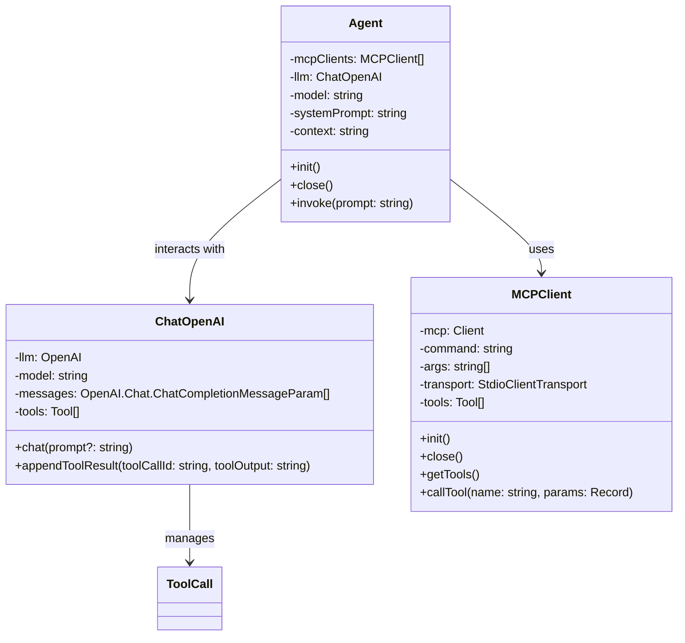

# Agent=LLM + MCP

#### 使用原生TypeScript、不依赖框架实现的简单版Agent，帮助你快速理解Agent底层逻辑




## **依赖**

```bash
git clone https://github.com/Serenity-2026/mini-agent.git
npm install
npm add dotenv openai @modelcontextprotocol/sdk chalk
```

## 参考
### LLM

- [OpenAI API](https://platform.openai.com/docs/api-reference/chat)

### MCP

- [MCP 架构](https://modelcontextprotocol.io/docs/concepts/architecture)
- [MCP Client](https://modelcontextprotocol.io/quickstart/client)
- [Fetch MCP](https://github.com/modelcontextprotocol/servers/tree/main/src/fetch)
- [Filesystem MCP](https://github.com/modelcontextprotocol/servers/tree/main/src/filesystem)

